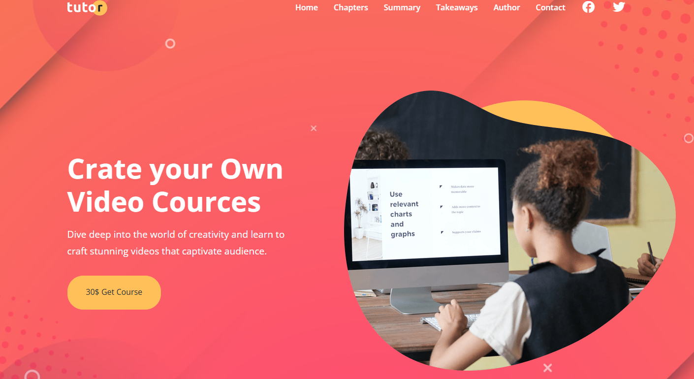
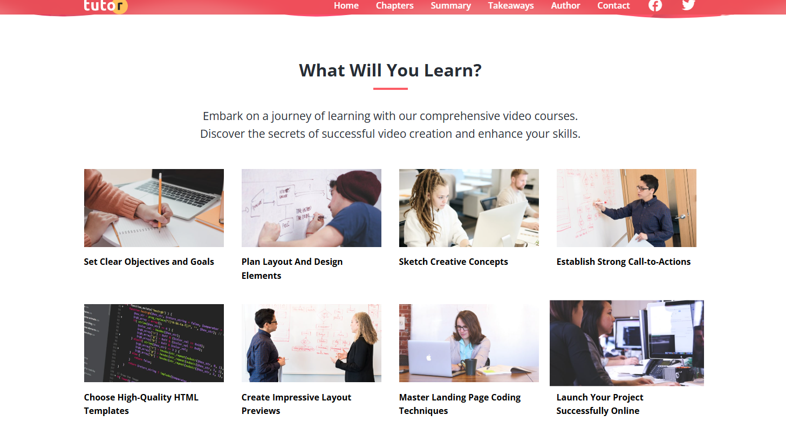
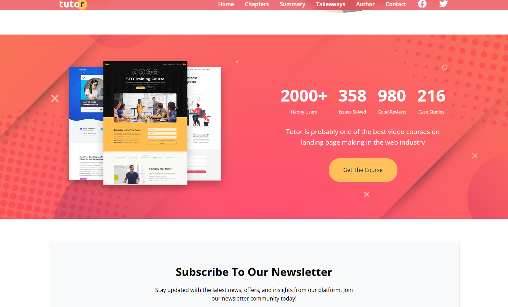
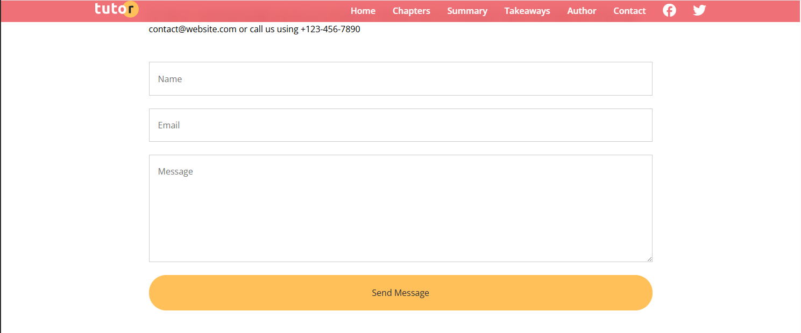
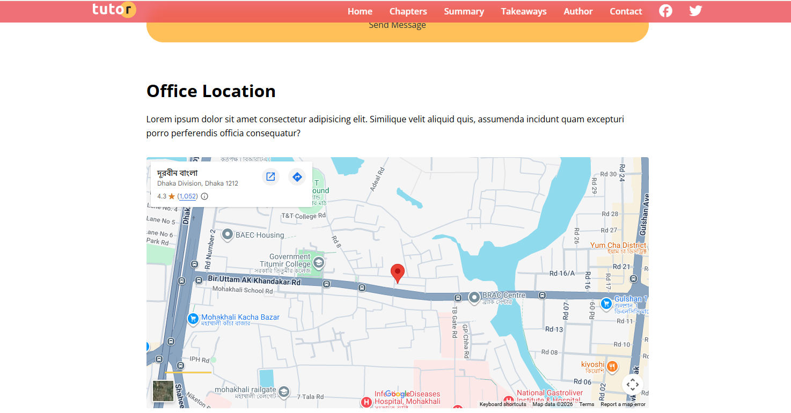

# Tutor - Online Course Website 🎓

| Source Code | Live Demo |
| :--- | :--- |
| [📂 View Code](https://github.com/rakibul-efty20/tutor-website-css) | [🚀 View Live Site](https://tutor-website-css.vercel.app/) |

---

## 📖 Project Overview

A fully responsive, multi-page website for a fictional online video course platform. This project was built as part of the **"Build Modern Responsive Websites with HTML and CSS"** course on Udemy.

This project showcases a modern landing page for an educational platform. It features a clean, professional design with a focus on accessibility and responsiveness. The layout shifts seamlessly from a desktop view to a mobile-friendly interface using media queries.

### 🌟 Key Features

* **Responsive Navigation:** Includes a mobile-friendly "hamburger" menu that toggles on smaller screens.
* **Hero Section:** A full-width header with a background image overlay and call-to-action buttons.
* **Feature Grid:** Uses **CSS Flexbox** to create aligned columns for course benefits and statistics.
* **Overlay Effects:** Utilizes advanced CSS positioning to create split-screen visual effects (as seen in the "Who is this for" section).
* **Utility Classes:** Implements a reusable utility class system (e.g., `.btn`, `.container`, `.text-primary`) for consistent styling.

## 🛠️ Technologies Used

* **HTML5:** Semantic structure (using `<header>`, `<nav>`, `<section>`, `<footer>`).
* **CSS3:**
    * **Flexbox:** For the main layout and alignment.
    * **CSS Variables:** For consistent color management (e.g., `--primary-color`).
    * **Media Queries:** To handle breakpoints at 1200px, 992px, 768px, and 576px.
* **Font Awesome:** For icons (user, checkmarks, social media).
* **Google Fonts:** Used for typography.

## 📚 What I Learned

Building this project helped reinforce several core CSS concepts:
* **The "Overlay Mask" Technique:** How to layer a solid color div over a background image to create a readable text area.
* **Breakout Images:** Using negative margins to make images break out of their containers for a dynamic look.
* **Mobile-First vs. Desktop-First:** Writing media queries to handle layout shifts for tablets and phones.
* **Form Styling:** Customizing input fields and buttons to match the brand theme.

## 📷 Screenshots

### Desktop View

---

